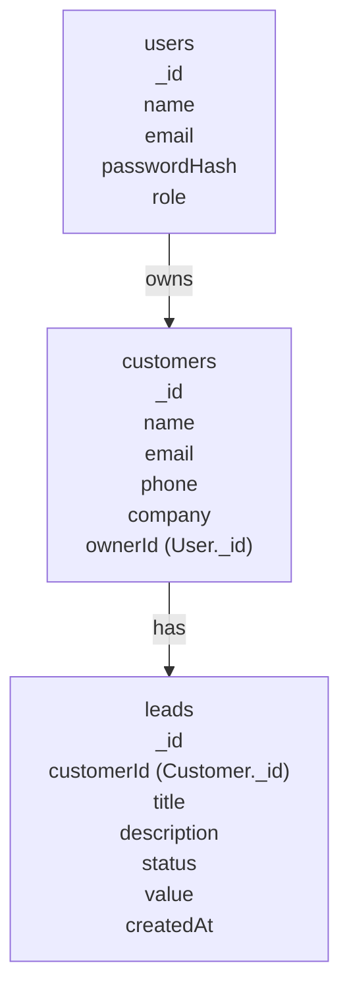

# CRM Mini App - MongoDB Schema Diagram

- **users**: Registered users (Admin/User)
- **customers**: Each customer belongs to a user (ownerId)
- **leads**: Each lead is linked to a customer (customerId)

> You can visualize this diagram using a Mermaid live editor or compatible Markdown viewer.
